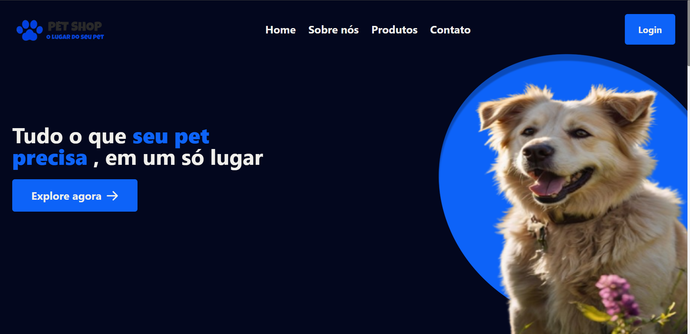

# Pet Shop 🐶🐾

Bem-vindo ao PetShop Website! Este projeto é um site moderno e responsivo para petshops, desenvolvido com TypeScript, React e Tailwind CSS. O objetivo é oferecer uma plataforma amigável e atraente para donos de pets explorarem serviços, produtos e informações.

### 🚀 Tecnologias

- **React**: Biblioteca JavaScript para criação de interfaces de usuário.
- **TypeScript**: Superset do JavaScript que adiciona tipos estáticos.
- **Tailwind CSS**: Framework CSS utilitário para estilização rápida e eficiente.

## 🖥️ Funcionalidades

- Página inicial com informações sobre o petshop.
- Seção de serviços: banho, tosa, consultas veterinárias, etc.
- Loja virtual com catálogo de produtos para pets.
- Formulário de contato para agendamento de serviços e envio de dúvidas.
- Design responsivo para uso em dispositivos móveis, tablets e desktops.